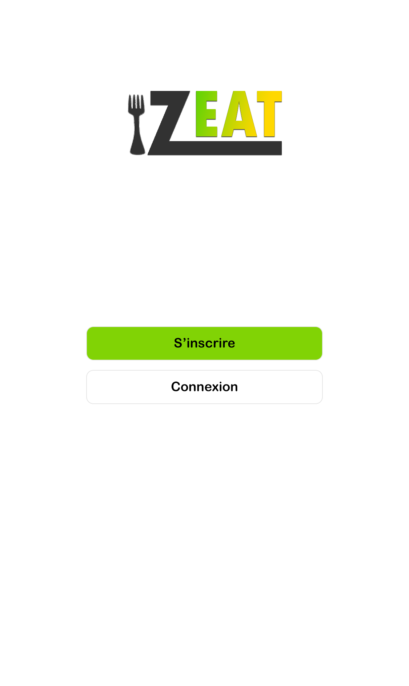
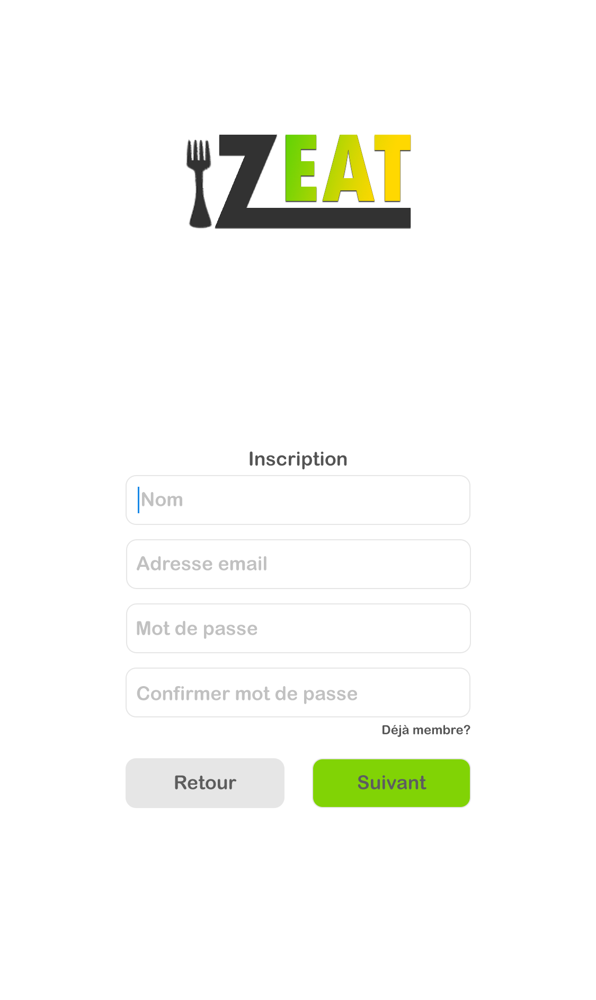
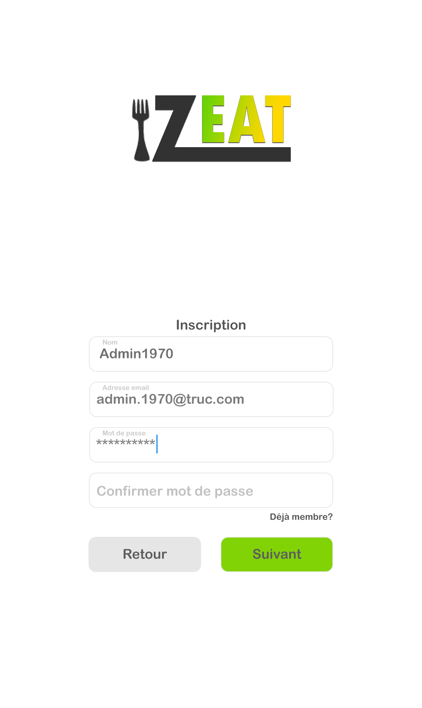
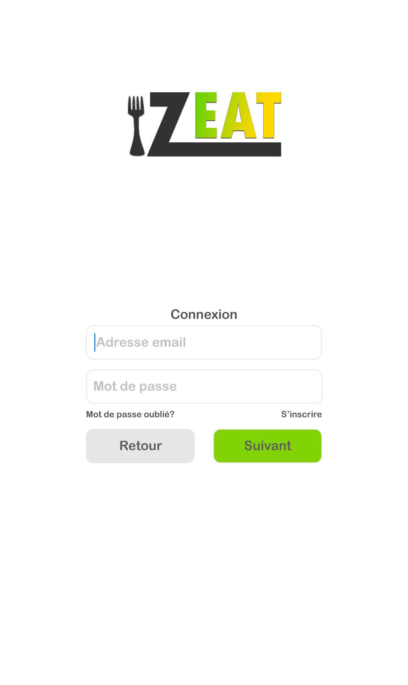
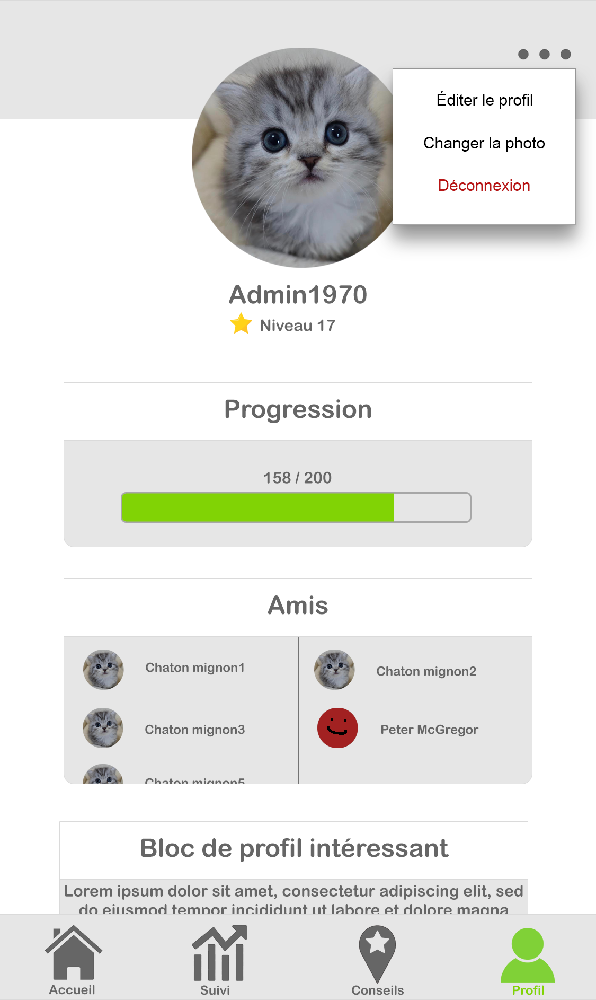
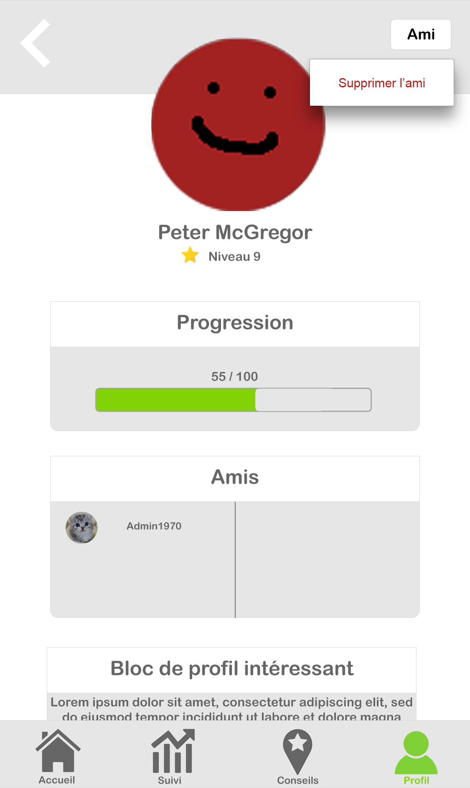

=== Interface utilisateur graphique

//Il peut y avoir une ou plusieurs interfaces utilisateur (UI en anglais),
//ou interface graphique, ou interface homme machine (IHM) : une interface
//sur ordinateur et/ou une interface sur mobile ou tablette (Android),
//selon le nombre d’appareils en jeu.

//En lien avec un diagramme de séquence, une description simple de chaque
//écran/page est nécessaire. Il est recommandé de faire des dessins, même
//dessins au crayon photographiés ou scannés, car ce sont les meilleurs
//supports de discussion : on appelle souvent ces dessins un
//« storyboard ». Une description textuelle fait le lien entre tous les
//éléments de l’IHM (ou des IHMs).

*NB:* La charte graphique des interfaces n'est pas encore définitive et pourra
donc être modifiée dans le futur. En particulier, le module SES d'ergonomie
apportera des éléments important dans la conception de l'interface graphique.
Le storyboard présenté ici est donc un point de départ de conception de 
l'application amené à changer par la suite.

