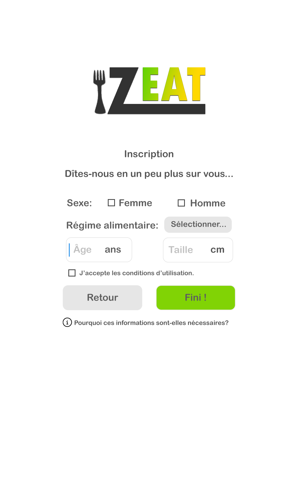

=== Interface utilisateur graphique

//Il peut y avoir une ou plusieurs interfaces utilisateur (UI en anglais),
//ou interface graphique, ou interface homme machine (IHM) : une interface
//sur ordinateur et/ou une interface sur mobile ou tablette (Android),
//selon le nombre d’appareils en jeu.

//En lien avec un diagramme de séquence, une description simple de chaque
//écran/page est nécessaire. Il est recommandé de faire des dessins, même
//dessins au crayon photographiés ou scannés, car ce sont les meilleurs
//supports de discussion : on appelle souvent ces dessins un
//« storyboard ». Une description textuelle fait le lien entre tous les
//éléments de l’IHM (ou des IHMs).

*NB:* 
La charte graphique des interfaces n'est pas encore définitive et pourra
donc être modifiée dans le futur. En particulier, le module SES d'ergonomie
apportera des éléments important dans la conception de l'interface graphique.
De plus une partie importante de l'application est son côté progressif. 
Plus la fréquence d'utilisation est élevée, plus l'utilisateur
se verra proposé des nouvelles fonctionnalités qui seraient inutiles pour un
utilisateur lambda. Ainsi le storyboard devra être différent à différents stades
d'utilisation. Ce côté de l'application étant pour l'instant en discussion, il
est absent dans cette version du storyboard.
Le storyboard présenté ici est donc un point de départ de conception de 
l'application amené à changer par la suite.

image::../images/storyboard/Premiere_utilisation.png[Première ouverture de l'application, 600, 1000]

image::../images/storyboard/inscription_-_suite_cliqué.png[Inscription - Suite bouton cliqué, 600, 1000]

On voit ci dessus (6 premières images) que l'on va devoir coder une première 
activité très simple mais essentielle. Celle de la connexion/inscription.
L'interface y comportera plusieurs champs d'entrée : identifiants et mot de passe.
Pour l'inscription, on programmera selon toute vraisemblance une activité
différente pour la première utilisation : l'activité d'inscription. Elle
comportera des champs en plus bien évidemment pour la création d'un nouveau
compte.
De plus cette activité devra gérer l'envoi des informations utilisateurs
sensibles (mot de passe, adresse mail) au serveur.

Ici une activité qui sera des plus importantes dans le cadre de notre volonté 
d'une application ergonomique. C'est la que l'utilisateur entrera sa nourriture
et donc c'est ce qu'il verra en premier lors d'un lancement standard de
l'application. On peut y voir aussi un accès à son frigo virtuel qui est donc un
lien vers une autre activité dont la conception graphique est importante. Les
choses les plus mises en valeurs sont évidemment les méthodes pour faire entrer
les aliments dans l'application. Cela sera peut être à retravailler pour voir s'il
n'est pas plus simple d'avoir immédiatement une méthode par défaut plutôt que
des liens vers les méthodes. Le défi de cette activité est dans tous les cas de
donner toutes les possibilités à l'utilisateur dans une interface la plus épurée
possible.

image::../images/storyboard/ajout_aliment_photo.png[Scan code-barres, 600, 1000]

Pour ces deux activités on doit programmer l'accès à la caméra du téléphone. De
plus on devra prendre soin de bien relier cette interface au système de
reconnaissance d'image : il faut savoir si l'interprétation de l'image peut être 
faite localement ou si l'on doit programmer un système qui détermine uniquement
si l'image est exploitable avant de l'envoyer sur serveur pour l'interprétation.
L'interface devra de toute façon présenter en direct à l'utilisateur si son image
est exploitable.

image::../images/storyboard/selection_aliment.png[Sélection aliment, 600, 1000]

La sélection d'aliment consistera elle uniquement en l'affichage d'une liste qui
qui évolue en fonction des caractères tapés par l'utilisateur dans la barre de
recherche. Il faudra donc du côté client uniquement récupérer les caractères
entrés et les envoyer au serveur, lequel renverra une liste correspondant à la
recherche dont le client gerera l'affichage et les interactions.

*ToDo*

*ToDo*

image::../images/storyboard/profil_bouton_haut_droit_cliqué.png[Onglet profil, 600, 1000]
image::../images/storyboard/profil_bouton_haut_droit_cliqué_ami.png[Première ouverture de l'application, 600, 1000]

L'onglet ici est l'onglet associé au réseau social qu'apportera l'application.
Le système de progression est ici très succinct mais est sujet à nombreuses
modifications lorsque la manière d'implémenter le côté social sera mieux définie.
Sont présent toutefois les éléments les plus évidents : On devra pouvoir avoir
une vue rapide de ses contacts sur l'application qui seront aussi un lien pour
accéder à leur profil. On devra donc programmer deux interface : le profil
personnel et le profil d'un contact, le profil d'un contact étant finalement une
version allégée du profil personnel.

