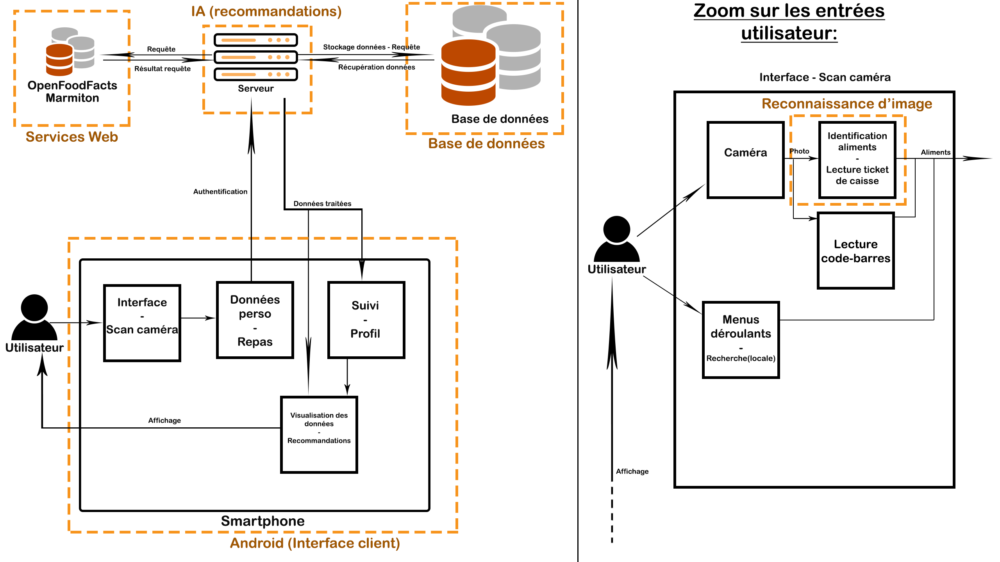

=== Schéma d’architecture

==== Description des blocs

*ToDelete*
Il faut ici une description textuelle de chaque bloc, sa fonction
détaillée. En général, un bloc correspond à un module, sauf exception.
Il peut être adapté de faire des blocs plus petits qu’un module.

Il est important ici de distinguer les bibliothèques identifiées et
disponibles de ce que vous allez produire (coder) vous même. Vous ne
devez pas réinventer la roue mais vous ne devez pas non plus avoir votre
projet tout fait en encapsulant un programme déjà existant.

===== Android

*ToDo*

===== Services Web

Le module services web nous permettra d'utiliser efficacement l'API 
d'OpenFoodFacts où sont enregistrées des données nutritionelles. Ce module est 
aussi l'occasion de développer notre propre service web afin d'effectuer la
communication entre le client (l'application Android) et le serveur. En effet,
l'application n'a pas besoin d'un flux de données important pour fonctionner et
par conséquent, traiter la communication entre le client et le serveur comme un
Service Web semble un choix judicieux.

===== Base de données

*ToDo*

===== IA

*ToDo*

===== Classification automatique

Le module classification automatique intervient lors de l'entrée de données dans
l'application. Plusieurs options seront à disposition pour l'utilisateur pour
rentrer ces données, notamment le scan d'un ticket de caisse pour reconnaitre
les aliments qui ont été achetés, ou l'identification de l'aliment par
reconnaissance d'image. Ces différentes options ont pour but de faciliter 
l'utilisation de l'application pour l'utilisateur. Ainsi, la classification 
automatique sera le moyen employé pour implémenter les deux types d'entrées
ci-dessus. On notera que l'accès à la caméra se fait facilement à l'aide de
librairies et que la difficulté principale est d'adapter un algorithme de 
classification automatique des images pour l'alimentaire, la reconnaissance de
texte sur le ticket de caisse étant un cas d'école.